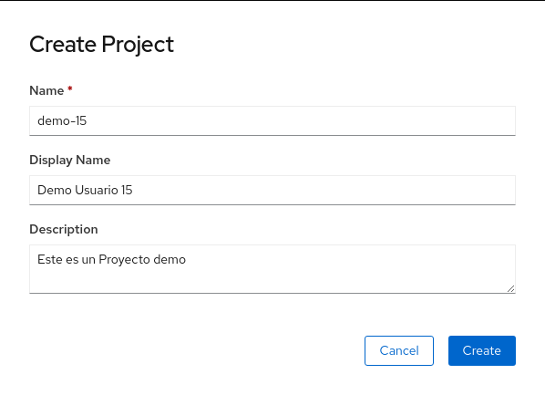

== Welcome to OpenShift

This lab provides a quick tour of the console to help you get familiar with the user interface along with some key terminology we will use in subsequent lab content. If you are already familiar with the basics of OpenShift simply ensure you can login and create the project.

== Key Terms

We will be using the following terms throughout the workshop labs so here are some basic definitions you should be familiar with. You'll learn more terms along the way, but these are the basics to get you started.

* *Container* - Your software wrapped in a complete filesystem containing everything it needs to run.
* *Image* - We are talking about docker images; read-only and used to create containers.
* *Pod* - One or more containers that run together.
* *Service* - Provides a common DNS name to access a pod (or replicated set of pods).
* *Project* - A project is a group of services that are related logically.
* *Deployment* - an update to your application triggered by an image change or config change.
* *Build*  - The process of turning your source code into a runnable image.							
* *BuildConfig* - configuration data that determines how to manage your build.
* *Route* - a labeled and DNS mapped network path to a service from outside OpenShift. 							
* *Master* -  The foreman of the OpenShift architecture, the master schedules operations, watches for problems, and orchestrates everything.							
* *Node* - Where the compute happens, your software is run on nodes

== Log into the web console

OpenShift provides a web console that allows you to perform various tasks via a web browser. Additionally, you can utilize a command line tool to perform tasks. We will be focusing on the web console today.

. Use your *browser* to navigate to the URL provided by your instructor.
. Login with the *user/password* provided.

== Create an empty project

First let's create a new project to do our workshop work in. We will use the student number you were given to ensure you don't clash with classmates, so in the steps below replace *'YOUR#'* with your student number (if applicable).

. Click the *Create Project* button
. Populate Name with *demo-YOUR#*
. Populate the *Display Name* and *Description* with whatever you’d like
. Click *Create*

.Create Project
[#lab1-project]
[caption="Figure 1: "]

